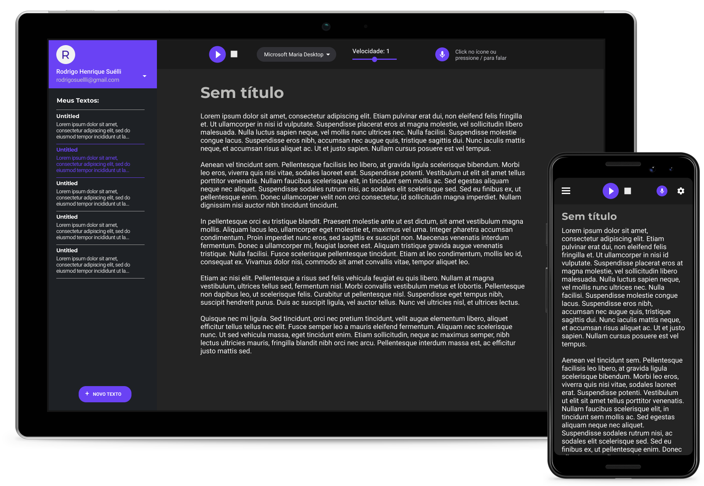

# Ditey



## Tecnologias

Esse projeto foi desenvolvido com as seguintes tecnologias:

- [React](https://reactjs.org)
- [Web Speech API](https://developer.mozilla.org/en-US/docs/Web/API/Web_Speech_API)

## Sobre esse Projeto

O Ditey é um leitor de textos que visa facilitar a vida das pessoas ao trabalharem com leitura, transcrição e
anotação de textos. O ditey permite que o usuário mantenha seus textos salvos no banco de dados, e mude a velocidade e a
voz da
fala. Por baixo dos panos, o ditey usa a [Web Speech
API](https://developer.mozilla.org/en-US/docs/Web/API/Web_Speech_API) para fazer a leitura dos textos.

## Observações

- Devido a compatibilidade da [Web Speech
API](https://developer.mozilla.org/en-US/docs/Web/API/Web_Speech_API), algumas funções do projeto podem não funcionar
corretamente em alguns navegadores.

## Layout

No link abaixo você encontra o layout do projeto. Lembrando que você precisa ter uma conta no
[Figma](http://figma.com/) para poder interagir com os componentes do layout.

- [Layout](https://www.figma.com/file/hgQpYoXRdoP9ht9JF1V26N/Ditey)

## Instalação

**Clone o Repositório**

```
git clone https://github.com/rodrigosuelli/ditey-web.git

cd ditey-web
```

**Instale as dependências**

```
npm install
```

_ou_

```
yarn
```

**Rode o projeto no modo de desenvolvimento**

```
npm run start
```

_ou_

```
yarn start
```

## Como contribuir

1. Faça um fork desse repositório
2. Crie uma branch com a sua alteração (`git checkout -b feat/minha-feature`)
3. Faça commit das suas alterações (`git commit -m 'feat: minha nova feature'`)
4. Faça push para a sua branch (`git push origin feat/minha-feature`)
5. Abre sua Pull Request no repositório que você fez o fork

## Licença

Este projeto está licenciado sob a licença [MIT](./LICENSE).
